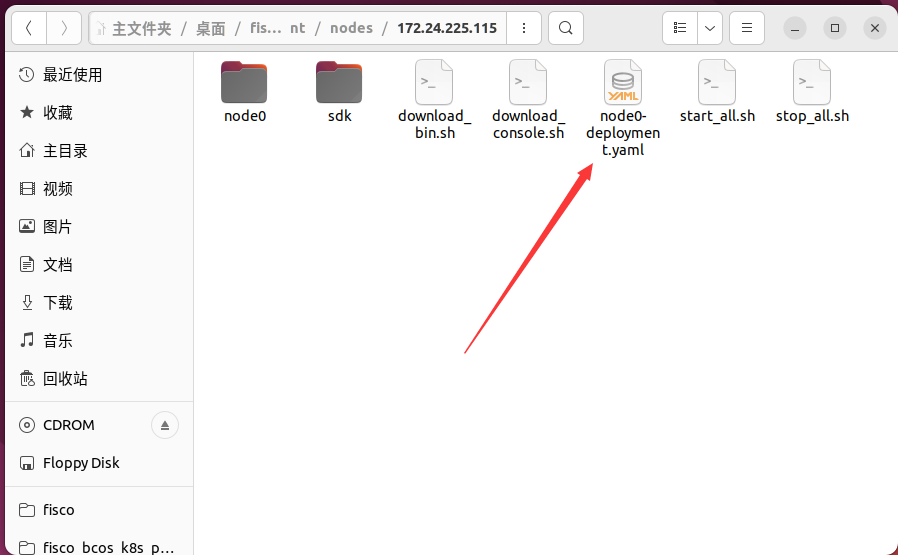
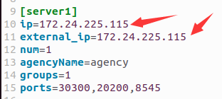
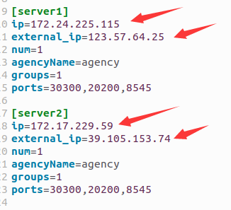
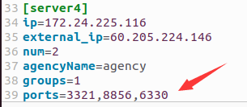
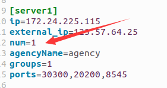
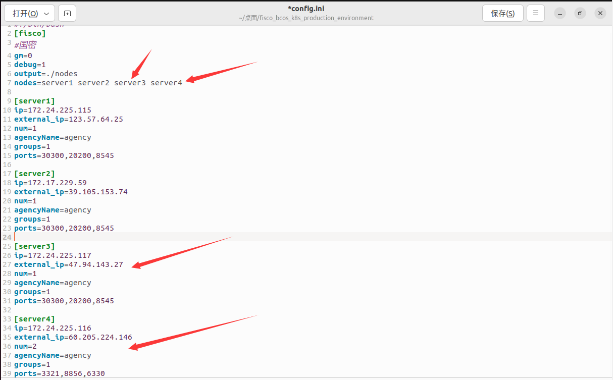
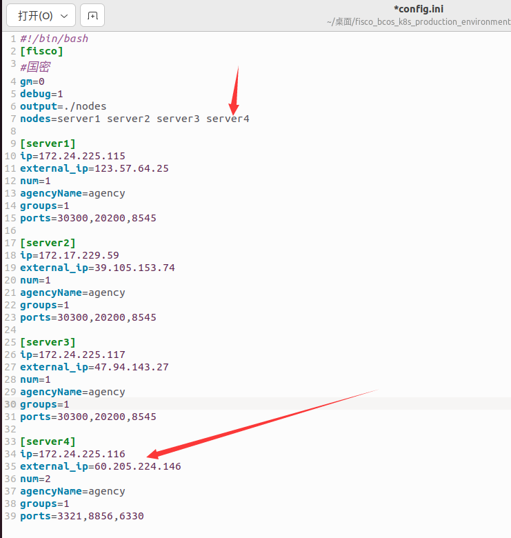

# Fisco_K8s

支持多机多k8s集群的FISCO部署脚本，自动为每个节点生成k8s的deployment编排文件。

脚本支持以下特性：

- 修改配置文件动态新增服务器和节点，平滑扩容

  - 运行build.sh脚本并将生成的节点部署到对应的机器后 ，如果想要新增节点，只需修改config.ini配置文件并重新运行脚本，再将新生成的节点文件发送至对应机器即可。具体流程见后续使用教程

- 修改配置文件动态新增分组，无需通过console控制台

  - 运行build.sh脚本并将生成的节点部署到对应的机器后 ，如果想要新增分组，只需修改config.ini配置文件中机器的groups配置项并重新运行脚本，再将对应的节点文件发送至相应机器即可。

- 动态生成k8s的deployment编排文件

  - 运行build.sh脚本后，除了生成节点文件外，脚本还会在`{output_dir}/{nodeip}`文件夹下生成每个节点对应的deployment编排文件。图示如下：

    

- 支持单k8s集群条件下的节点生成

  - 脚本支持单k8s集群条件下的节点生成，此时只需要将config.ini中节点的ip和external_ip设置为该机器在集群内的ip即可。如下图所示：

    

- 支持多k8s集群条件下的节点生成

  - 脚本支持多k8s集群条件下的节点生成，此时config.ini中节点的ip需要设置为该机器在集群内的ip；config.ini中节点的external_ip需要设置为该机器可供其他集群的机器访问的公网ip。例如机器1的公网ip为：123.57.64.25，内网ip为：172.24.225.115；机器2的公网ip为：39.105.153.74，内网ip为：172.17.229.59。则config.ini的配置如下：

    

- 支持自定义端口

  - 脚本支持节点端口的自定义，用户可以通过修改config.ini中的ports配置项来定义节点端口。下面给出一个示例：

    

    在该配置中，机器4的节点端口自定义为3321,8856,6330。同时由于num=2，因此脚本会为该机器生成两个节点文件。这两个节点的端口分别为3321,8856,6330；3322,8857,6331

- 支持已经进行部署并产生交易的区块链进行节点扩容

  - 通过脚本进行节点扩容时，不用进入生产环境中拷贝其他节点的数据，只需将新生成的节点发送至对应机器并运行后，再将其加入区块链共识即可完成扩容。旧的节点在扩容过程中无须停止运行；已经产生的交易记录也不会丢失

- 支持一次新增多台机器或多个节点

  - 可以通过修改config.ini中某台机器的num配置来为该机器新增一个或多个节点

    

  - 可以通过修改config.ini中的nodes并添加对应的机器配置来新增一个或多个机器，这里以新增机器3和机器4为例

    

- 生成的节点支持区块链浏览器的订阅

  - 通过脚本生成的节点文件在运行后可通过区块链浏览器直接订阅，无须再次手动修改节点文件

## config.ini文件配置示例

~~~bash
#!/bin/bash
[fisco]
#国密
gm=0
#是否启动debug模式
debug=1
#输出文件夹
output=./nodes
#机器数及机器名
nodes=server1 server2 server3
#机器1的详细配置，ip为内网ip，external_ip为公网ip,num为该机器上的节点数，groups为该机器上节点的所属群组，ports为该机器上首个节点的端口号（其余节点将按照用户配置的端口号进行自增）
[server1]
ip=172.24.225.115
external_ip=123.57.64.25
num=1
agencyName=agency
groups=1
ports=30300,20200,8545

[server2]
ip=172.17.229.59
external_ip=39.105.153.74
num=1
agencyName=agency
groups=1
ports=30300,20200,8545

[server3]
ip=172.24.225.117
external_ip=47.94.143.27
num=1
agencyName=agency
groups=1
ports=30300,20200,8545
~~~

- 多机单集群时，ip和external_ip取相同值，多机多集群时，external_ip为其他集群可访问该机器的公网ip

## 使用教程

### 生成节点

~~~bash
./build.sh
~~~

### 发送节点文件

- 在各个机器上新建`fisco/nodes`文件夹

- 将生成的节点文件发送到各自机器的`fisco/nodes`文件夹中

### 启动节点

- 以启动172.24.225.115机器上的节点为例

~~~bash
cd fisco/nodes/172.24.225.115
kubectl apply -f node*-deployment.yaml
~~~

### 查看状态和共识

~~~bash
tail -f nodes/172.24.225.115/node0/log/log*  | grep connected
tail -f nodes/172.24.225.115/node0/log/log*  | grep +++
~~~

### 修改config.ini新增节点或分组

- 以新增server4为例，修改config.ini。修改后的config.ini如下：

  

- 再次运行build脚本

### 发送新节点文件

- 在server4机器上新建`fisco/nodes`文件夹
- 发送新生成的`172.24.225.116`文件夹到server4机器上的`fisco/nodes`文件夹中

### 启动新节点

~~~bash
cd fisco/nodes/172.24.225.116
kubectl apply -f node*-deployment.yaml
~~~

### 将新节点加入共识

- 运行仓库中的Fisco_SpringBoot项目，调用addnodes方法将新节点加入共识或使用区块链控制台手动加入
