# Fisco_SpringBoot

基于SpringBoot2.7引入FISCO的Java SDK，对外暴露AssetLeasingTable智能合约里的Api供前端调用和测试

## 项目环境

- Java1.8
- SpringBoot2.7
- FISCO BCOS区块链系统（支持单机和多机）
  - 单机区块链：基于FISCO文档在本地搭建出的四节点联盟链，文档地址：https://fisco-bcos-documentation.readthedocs.io/zh-cn/latest/docs/installation.html 
  - 多机区块链：在一个或多个k8s集群上搭建区块链
    - 多机单集群：教程详见目录下：`“使用Docker容器化部署FISCO BCOS区块链系统.md”`和`“在kubernetes(k8s)集群上部署FISCO BCOS区块链系统.md”`
    - 多机多集群：部署脚本及教程详见`“../Fisco_K8s”`目录
- AssetLeasingTable智能合约所生成的对应Java类（已添加进项目里），AssetLeasingTable.sol详见`“../Contract”`目录

## 项目教程

### 添加FISCO BCOS区块链系统依赖

- 在pom.xml中添加FISCO BCOS区块链系统的Java SDK依赖

~~~xml
<dependency>
	<groupId>org.fisco-bcos.java-sdk</groupId>
	<artifactId>fisco-bcos-java-sdk</artifactId>
	<version>2.9.1</version>
</dependency>
~~~

### 拷贝区块链秘钥

- 在项目目录的resources下建立新文件夹conf

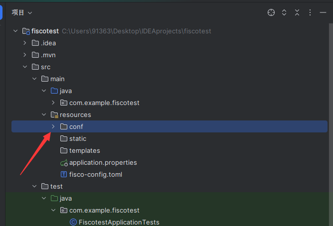

- 将“区块链文件夹/nodes/${ip}/sdk/”目录下的证书拷贝到conf文件夹中
- 我的区块链文件夹是fisco，部署的是本地四节点区块链，因此我这里的ip是127.0.0.1，文件夹下的证书如下

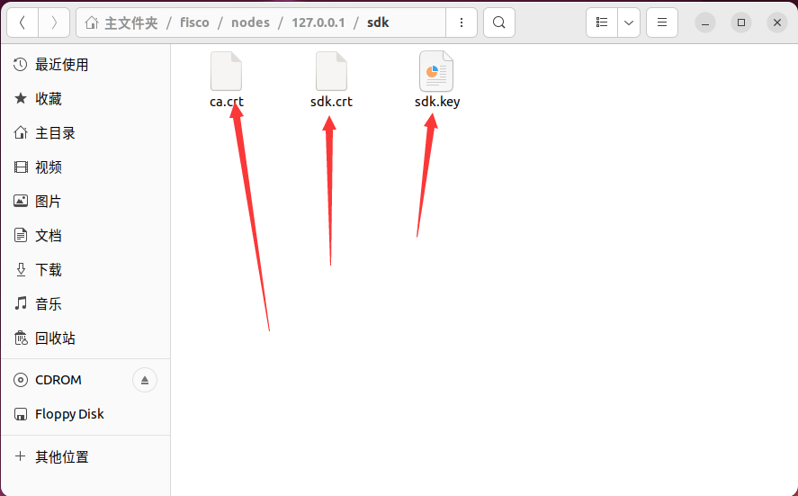

- 我这里是单机区块链，所以只有一个sdk文件夹，如果是多集群下的区块链则会有很多个“/nodes/${ip}/sdk/”目录。此时只需要选择其中一个目录下的证书进行拷贝即可。同时在下一步”配置连接区块链系统“时，只需要连接该证书所对应的区块链节点。

### 配置连接区块链系统

- 在项目的resources下创建配置文件 fisco-config.toml

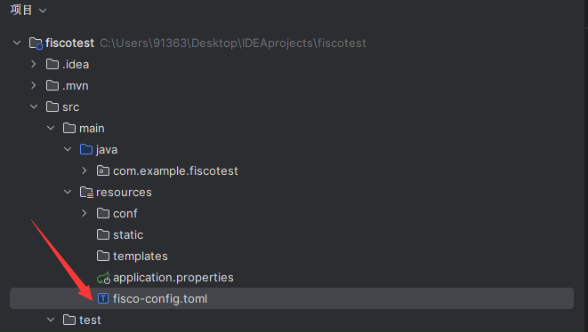

- 下面给出fisco-config.toml的示例代码

~~~toml
[cryptoMaterial]
certPath = "conf"                           # The certification path  

# The following configurations take the certPath by default if commented
# caCert = "conf/ca.crt"                    # CA cert file path
# If connect to the GM node, default CA cert path is ${certPath}/gm/gmca.crt

# sslCert = "conf/sdk.crt"                  # SSL cert file path
# If connect to the GM node, the default SDK cert path is ${certPath}/gm/gmsdk.crt

# sslKey = "conf/sdk.key"                   # SSL key file path
# If connect to the GM node, the default SDK privateKey path is ${certPath}/gm/gmsdk.key

# enSslCert = "conf/gm/gmensdk.crt"         # GM encryption cert file path
# default load the GM SSL encryption cert from ${certPath}/gm/gmensdk.crt

# enSslKey = "conf/gm/gmensdk.key"          # GM ssl cert file path
# default load the GM SSL encryption privateKey from ${certPath}/gm/gmensdk.key

[network]
peers=["192.168.3.54:20200", "192.168.3.54:20201", "192.168.3.54:20202", "192.168.3.54:20203"]    # The peer list to connect

# AMOP configuration
# You can use following two methods to configure as a private topic message sender or subscriber.
# Usually, the public key and private key is generated by subscriber.
# Message sender receive public key from topic subscriber then make configuration.
# But, please do not config as both the message sender and the subscriber of one private topic, or you may send the message to yourself.

# Configure a private topic as a topic message sender.
# [[amop]]
# topicName = "PrivateTopic"
# publicKeys = [ "conf/amop/consumer_public_key_1.pem" ]    # Public keys of the nodes that you want to send AMOP message of this topic to.

# Configure a private topic as a topic subscriber.
# [[amop]]
# topicName = "PrivateTopic"
# privateKey = "conf/amop/consumer_private_key.p12"         # Your private key that used to subscriber verification.
# password = "123456"

[account]
keyStoreDir = "account"         # The directory to load/store the account file, default is "account"
# accountFilePath = ""          # The account file path (default load from the path specified by the keyStoreDir)
accountFileFormat = "pem"       # The storage format of account file (Default is "pem", "p12" as an option)

# accountAddress = ""           # The transactions sending account address
# Default is a randomly generated account
# The randomly generated account is stored in the path specified by the keyStoreDir

# password = ""                 # The password used to load the account file

[threadPool]
# channelProcessorThreadSize = "16"         # The size of the thread pool to process channel callback
# Default is the number of cpu cores

# receiptProcessorThreadSize = "16"         # The size of the thread pool to process transaction receipt notification
# Default is the number of cpu cores

maxBlockingQueueSize = "102400"             # The max blocking queue size of the thread pool

~~~

- 其中主要修改peers=["192.168.3.54:20200", "192.168.3.54:20201", "192.168.3.54:20202", "192.168.3.54:20203"]这一项，它代表你要连接的区块链中的节点的ip和端口，由于我的区块链系统运行在虚拟机上，所以我这里填的是虚拟机的ip地址，如果节点运行在本机上，则这里的ip地址填写127.0.0.1
- peers中所连接的节点需要与之前拷贝的sdk相对应，我这里是单集群，sdk可以匹配上区块链中的所有节点，所以可以在peers中填写所有的节点；如果是多集群，那么peers中只需要填写与之前拷贝进文件中的sdk所对应的节点ip和端口即可

### 将智能合约转换成Java类并引入项目

- 本项目已经把AssetLeasingTable智能合约所生成的Java类放入项目中，接下来我将以HelloWorld合约为例，介绍如何将一个新的智能合约转换成Java类并引入项目
- 编写好的智能合约想在Java项目中使用，则必须转换成Java类。FISCO BCOS系统给我们提供了转换脚本，但是我们需要先下载控制台

~~~bash
mkdir -p ~/fisco && cd ~/fisco
# 获取控制台
curl -#LO https://github.com/FISCO-BCOS/console/releases/download/v2.9.2/download_console.sh

# 若因为网络问题导致长时间无法执行以上命令，请尝试以下命令：
https://osp-1257653870.cos.ap-guangzhou.myqcloud.com/FISCO-BCOS/console/releases/v2.9.2/download_console.sh

bash download_console.sh

~~~

- 将需要使用到的Solidity智能合约放入fisco/console/contracts/solidity的目录。这里我使用console中的HelloWorld.sol作为例子。保证HelloWorld.sol在指定的目录下，然后进入目录fisco/console

~~~bash
# 进入目录~/fisco/console
cd ~/fisco/console
~~~

- 生成智能合约对应的Java类，这里需要根据使用的控制台版本来使用不同的命令

~~~bash
若控制台版本大于等于2.8.0：
# 使用sol2java.sh将contracts/solidity下的所有合约编译产生bin,abi,java工具类。
# 当前目录~/fisco/console
$ bash sol2java.sh -p org.com.fisco
# 以上命令中参数“org.com.fisco”是指定产生的java类所属的包名。
# 通过命令./sol2java.sh -h可查看该脚本使用方法

若控制台版本小于2.8.0：
# 使用sol2java.sh将contracts/solidity下的所有合约编译产生bin,abi,java工具类。
# 当前目录~/fisco/console
$ bash sol2java.sh org.com.fisco
# 以上命令中参数“org.com.fisco”是指定产生的java类所属的包名。
# ./sol2java.sh [packageName] [solidityFilePath] [javaCodeOutputDir]
~~~

- 将生成的Java类复制到项目中，所放的位置要与我们设定的包名相同

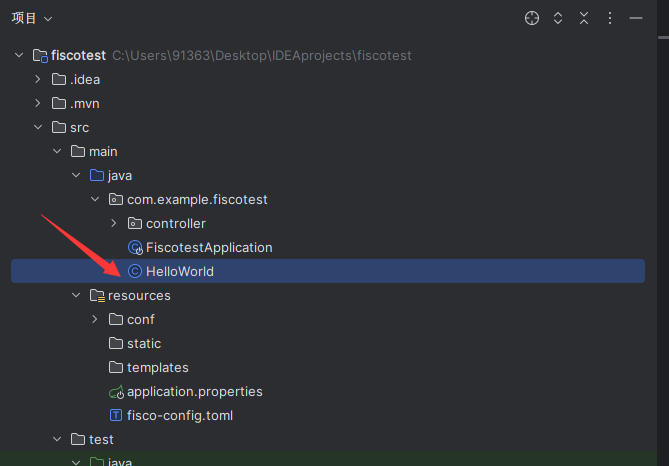

### 新建并编写控制器类

- 在项目中的controller包下，可以新建自己的控制器类，目前项目已经根据AssetLeasingTable智能合约编写了一些示例代码

- 在这里我以刚刚引入的HelloWorld合约为例，编写一下相关的控制器代码，代码如下

  ~~~java
  package com.example.fiscotest.controller;
  
  import com.example.fiscotest.HelloWorld;
  import org.fisco.bcos.sdk.BcosSDK;
  import org.fisco.bcos.sdk.client.Client;
  import org.fisco.bcos.sdk.crypto.keypair.CryptoKeyPair;
  import org.springframework.web.bind.annotation.GetMapping;
  import org.springframework.web.bind.annotation.PostMapping;
  import org.springframework.web.bind.annotation.RestController;
  
  @RestController
  public class FiscoController {
      public final String configFile = FiscoController.class.getClassLoader().getResource("fisco-config.toml").getPath();
      BcosSDK sdk =  BcosSDK.build(configFile);
      Client client = sdk.getClient(Integer.valueOf(1));
  
      HelloWorld helloWorld=null;
      @GetMapping("/deploy")
      public String deploycontract() throws Exception{
          CryptoKeyPair cryptoKeyPair = client.getCryptoSuite().getCryptoKeyPair();
          helloWorld = HelloWorld.deploy(client,cryptoKeyPair);
          return "deploy success!!";
      }
  
      @GetMapping("/get")
      public String getcontract() throws Exception{
          String value = helloWorld.get();
          return "ContractValue="+value;
      }
  
      @PostMapping("/set")
      public String setcontract(String name) throws Exception{
          helloWorld.set(name);
          String value = helloWorld.get();
          return "set success!! now ContractValue="+value;
      }
  }
  ~~~

  

### 测试Java SDK

- 以刚刚引入的HelloWorld合约为例，测试项目可否正常运行

- 运行SpringBoot项目
- 运行区块链节点

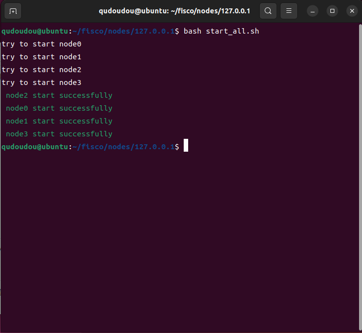

- 进入区块链中运行区块链浏览器

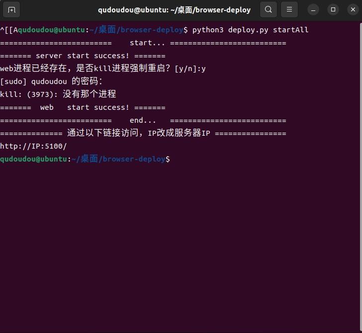

- 在本机通过访问http://${虚拟机ip}:5100,成功进入区块链浏览器

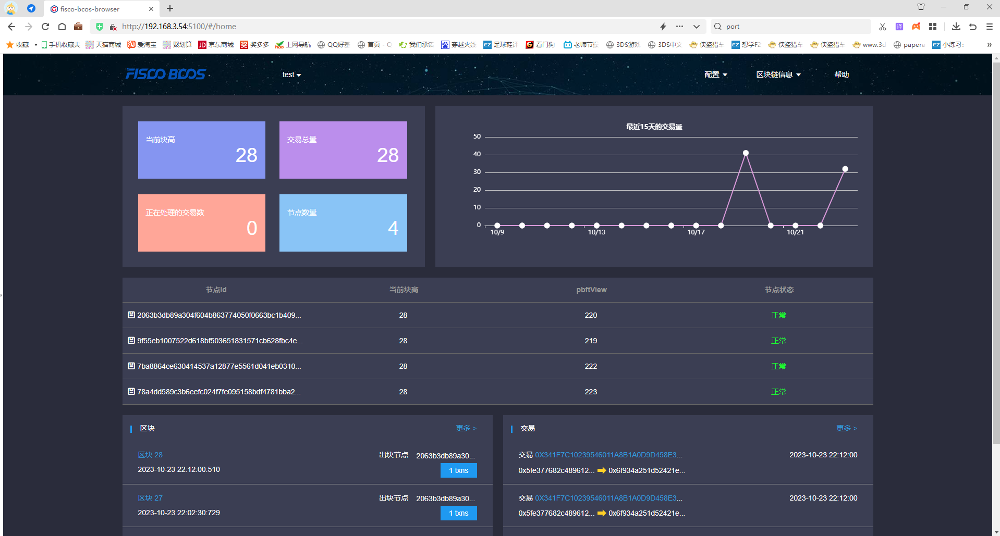

- 在本机通过浏览器测试智能合约的部署

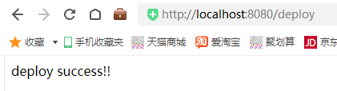

- 在本机通过浏览器测试智能合约名称的获取

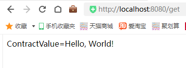

- 在本机通过ApiPost测试智能合约名称的修改

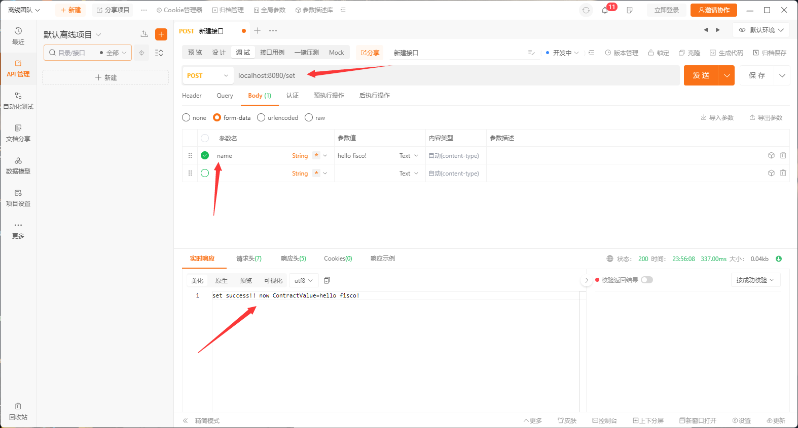

- 经过以上测试之后刷新区块链浏览器，发现数据发生变化，Java SDK在我们的项目中成功的进行调用

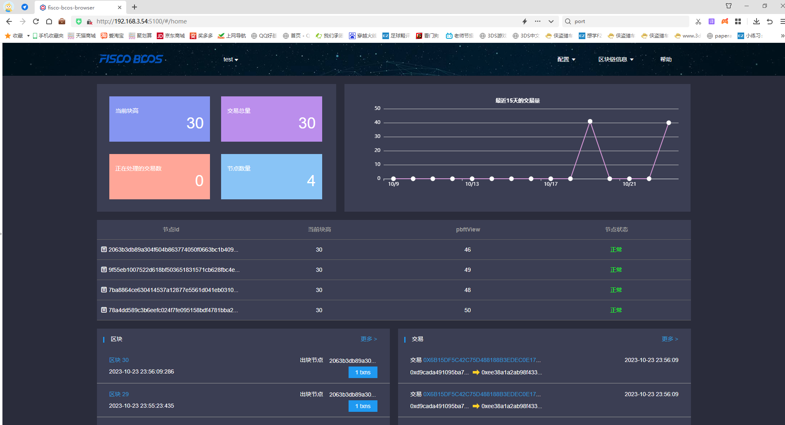
