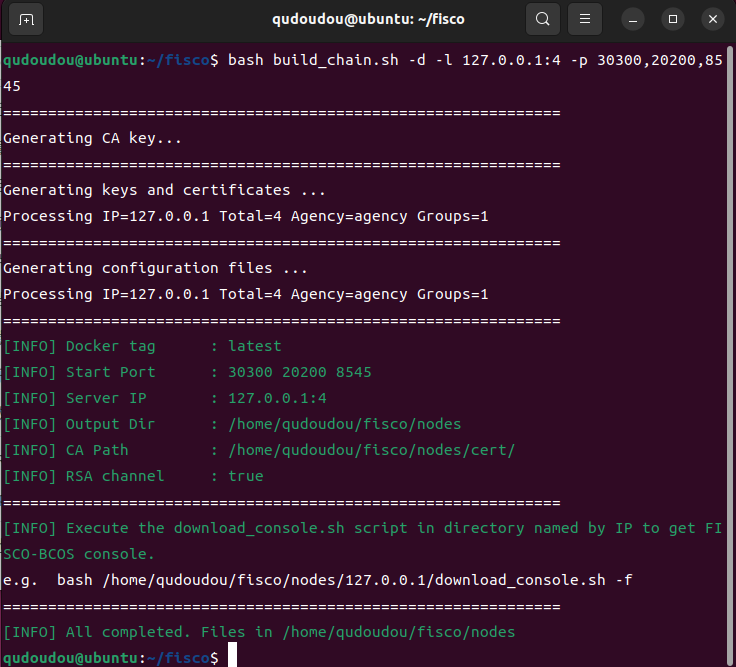
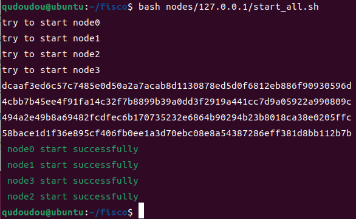
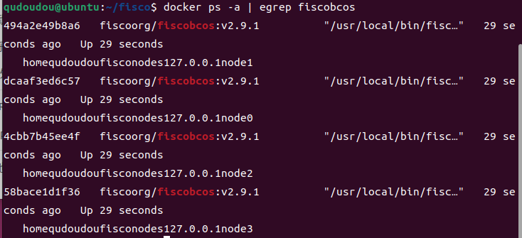
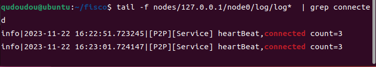
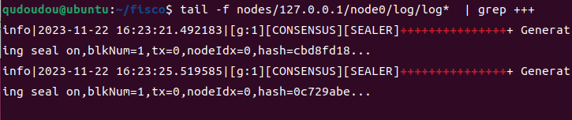
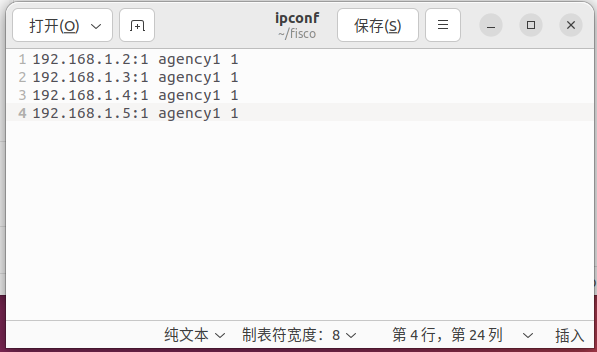
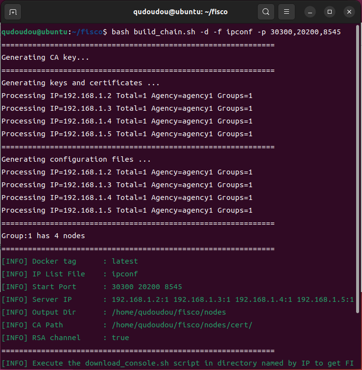
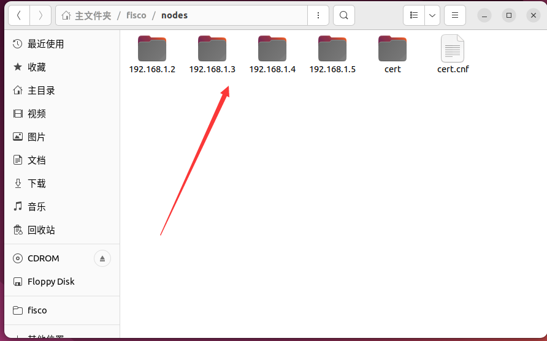

## 环境准备

- ubuntu22.04

- Docker

- 安装openssl

  ~~~bash
  sudo apt install -y curl openssl
  ~~~

## 搭建单群组的四节点区块链

本文将详细讲解“在本地模拟多台机器搭建单群组的四节点区块链”以及“在多台机器上搭建单群组的四节点区块链”这两种情景的搭建方法

### 在本地模拟多台机器来搭建单群组的四节点区块链

- 下载FISCO BCOS官方的安装脚本

  ~~~bash
  ## 创建操作目录
  cd ~ && mkdir -p fisco && cd fisco
  
  ## 下载脚本
  curl -#LO https://github.com/FISCO-BCOS/FISCO-BCOS/releases/download/v2.9.1/build_chain.sh && chmod u+x build_chain.sh
  ~~~

- 进入之前创建的fisco目录，执行以下指令即可在本地生成一条单群组的四节点区块链。其中，`-d`参数表示使用docker来构建区块链。请确保机器的`30300~30303，20200~20203，8545~8548`端口没有被占用，也可以通过`-p`参数指定其他端口

  ~~~bash
  bash build_chain.sh -d -l 127.0.0.1:4 -p 30300,20200,8545
  ~~~

  

- 执行`bash nodes/127.0.0.1/start_all.sh`命令来启动区块链。这行命令相当于进入每个节点目录后自动运行`docker run -d --rm --name ${nodePath} -v ${nodePath}:/data --network=host -w=/data fiscoorg/fiscobcos:latest -c config.ini`指令。运行`start_all.sh`时，机器会自动检查本地是否存在FISCO-BCOS对应版本的节点镜像，如果不存在的话则会从docker hub上下载

  

- 可以通过以下命令检查容器状态是否正常

  ~~~bash
  docker ps -a | egrep fiscobcos
  ~~~

  

- 可以通过检查日志来确认节点的p2p连接数目以及共识是否正常

  - 查看节点node0连接的节点数

    ~~~bash
    tail -f nodes/127.0.0.1/node0/log/log*  | grep connected
    ~~~
    
    
    
  - 检查共识
  
    ~~~bash
    tail -f nodes/127.0.0.1/node0/log/log*  | grep +++
    ~~~
    
    
  

### 在多台机器上搭建单群组的四节点区块链

- 假设有四台机器，IP地址分别为`192.168.1.2`、`192.168.1.3`、`192.168.1.4`、`192.168.1.5`。现在需要在这四台机器上使用docker部署单群组的四节点区块链，每台机器分别部署一个节点。

- 在`192.168.1.2`上下载FISCO BCOS官方的安装脚本

  ~~~bash
  ## 创建操作目录
  cd ~ && mkdir -p fisco && cd fisco
  
  ## 下载脚本
  curl -#LO https://github.com/FISCO-BCOS/FISCO-BCOS/releases/download/v2.9.1/build_chain.sh && chmod u+x build_chain.sh
  ~~~

- 进入`192.168.1.2`的fisco文件夹，新建ipconf文件并写入以下内容

  ~~~bash
  192.168.1.2:1 agency1 1
  192.168.1.3:1 agency1 1
  192.168.1.4:1 agency1 1
  192.168.1.5:1 agency1 1
  
  
  #按行分割，每一行表示一个服务器，格式为`IP:NUM AgencyName GroupList`，每行内的项使用空格分割，**不可有空行**。
  #`IP:NUM`表示机器的IP地址以及该机器上的节点数。`AgencyName`表示机构名，用于指定使用的机构证书。`GroupList`表示该行生成的节点所属的组，以`,`分割。例如`192.168.0.2:2 agency1 1,2`表示`ip`为`192.168.0.2`的机器上有两个节点，这两个节点属于机构`agency1`，属于group1和group2。
  ~~~
  
  
  
- 在`192.168.1.2`的fisco文件夹里执行以下指令生成区块链节点文件，`-f`表示从配置文件fiscoconf中读取配置

  ~~~bash
  bash build_chain.sh -d -f ipconf -p 30300,20200,8545 
  ~~~

  - 执行成功后将会在`192.168.1.2`机器下的`fisco/nodes`文件夹下生成以下文件

    

- 在其他主机上都新建`fisco/nodes`文件夹，并将`192.168.1.2`机器上的`fisco/nodes`文件夹中的`192.168.1.3`、`192.168.1.4`以及`192.168.1.5`这三个文件夹分别拷贝到其余三台机器中

- 进入四台主机上的`fisco/nodes/*`文件夹中（`*`代表各自机器的IP)，各自运行如下指令启动各自的节点

  ~~~bash
  bash start_all.sh
  ~~~
  
  运行该指令时，每台机器都会先检查自己机器上是否存在fisco镜像，如果不存在则从docker hub上下载
- 至此，在四台机器上搭建属于同一群组的四节点区块链成功！检查区块链共识以及上链节点数的方法与上文中的在单台机器上的检查方法相同
