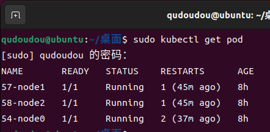

## 环境准备

- 三台ubuntu22.04主机（分别为`ubuntu：192.168.3.54`；`worker1:192.168.3.57`；`worker2:192.168.3.58`）
- 安装docker，kubernetes
- 三台主机加入同一kubernetes集群

## 创建区块链

- 使用上篇文章《使用Docker容器化部署FISCO-BCOS区块链系统》中的方法，在ubuntu这台主机上生成运行在三台主机上的区块链节点

  

- 分别进入三个文件夹中，修改节点的配置信息，我这里以修改192.168.3.54主机上的节点信息为示例(若不进行修改，则之后无法在区块链浏览器中正确绑定区块链节点)

  - 进入`192.168.3.54/node0`文件夹，打开`config.ini文件`

    

  - 将`jsonrpc_listen_ip`这一项从`127.0.0.1`更改为对应的主机ip，我这里是`192.168.3.54`

    

- 在worker1和worker2主机上都新建`fisco/nodes`文件夹，并将ubuntu主机上生成的`192.168.3.57文件夹`和`192.168.3.58文件夹`分别拷贝到这两台主机的`fisco/nodes`文件夹下

## 新建k8s配置文件

- 在ubuntu主机上新建名为`my-pod.yaml`的kubernetes配置文件，该文件用于启用ubuntu主机上的区块链节点，配置文件内容如下

  ~~~bash
  apiVersion: v1
  kind: Pod
  metadata:
    name: 54-node0
  spec:
    nodeName: ubuntu
    hostNetwork: true
    containers:
    - name: 54-node0
      image: fiscoorg/fiscobcos:v2.9.1
      args: ["-c", "config.ini"]
      workingDir: /data
      ports:
      - containerPort: 30300
      - containerPort: 20200
      - containerPort: 8545
      volumeMounts:
      - name: fisco-volume
        mountPath: /data
    volumes:
    - name: fisco-volume
      hostPath:
        path: /home/qudoudou/fisco/nodes/192.168.3.54/node0
        type: Directory
  ~~~

- 新建名为`worker1-pod.yaml`的kubernetes配置文件，该文件用于启用worker1主机上的区块链节点，配置文件内容如下

  ~~~bash
  apiVersion: v1
  kind: Pod
  metadata:
    name: 57-node1
  spec:
    nodeName: worker1
    hostNetwork: true
    containers:
    - name: 57-node1
      image: fiscoorg/fiscobcos:v2.9.1
      args: ["-c", "config.ini"]
      workingDir: /data
      ports:
      - containerPort: 30300
      - containerPort: 20200
      - containerPort: 8545
      volumeMounts:
      - name: fisco-volume
        mountPath: /data
    volumes:
    - name: fisco-volume
      hostPath:
        path: /home/qudoudou/fisco/nodes/192.168.3.57/node0
        type: Directory
  ~~~

- 新建名为`worker2-pod.yaml`的kubernetes配置文件，该文件用于启用worker2主机上的区块链节点，配置文件内容如下

  ~~~bash
  apiVersion: v1
  kind: Pod
  metadata:
    name: 58-node2
  spec:
    nodeName: worker2
    hostNetwork: true
    containers:
    - name: 58-node2
      image: fiscoorg/fiscobcos:v2.9.1
      args: ["-c", "config.ini"]
      workingDir: /data
      ports:
      - containerPort: 30300
      - containerPort: 20200
      - containerPort: 8545
      volumeMounts:
      - name: fisco-volume
        mountPath: /data
    volumes:
    - name: fisco-volume
      hostPath:
        path: /home/qudoudou/fisco/nodes/192.168.3.58/node0
        type: Directory
  ~~~

- 注意：以上三个配置文件可以写在同一个文件中。配置文件里`hostNetwork: true`表示启动的pod会使用宿主机网络的命名空间，因此k8s集群外的服务可以直接用机器ip+port的方式来获取区块链的信息，方便后续的使用。同时配置文件里还创建了一个路径为`/home/qudoudou/fisco/nodes/192.168.3.58/node0`的挂载，将该区块链节点的文件夹挂载到pod里，之后pod产生的数据就会存储在该文件夹里，这里的路径需要根据第一步拷贝区块链节点时的位置而定

## 启动区块链节点

使用`kubectl apply -f my-pod.yaml`、`kubectl apply -f worker1-pod.yaml`、`kubectl apply -f worker2-pod.yaml`三条语句启动区块链节点

- 使用`kubectl get pod`查询三个节点是否都启动成功

- 进入ubuntu主机的fisco文件夹，使用`tail -f nodes/192.168.3.54/node0/log/log*  | grep connected`命令查看ubuntu主机上的节点与其他两台机器上的节点的连接情况，发现连接数量为2，证明三个节点都成功上链

  

## 查看区块链信息

- 启动区块链浏览器，配置群组和节点

  

- 成功连接上三台机器上的节点，对节点进行HelloWorld合约的部署等操作后，可以在区块链浏览器里成功观测到交易数量等信息发生改变

  
