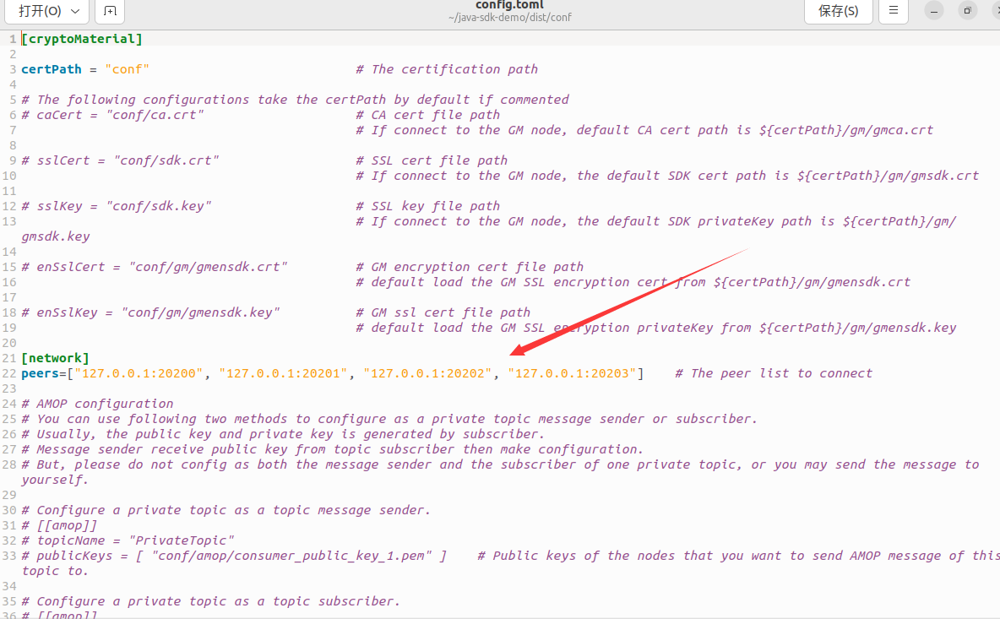
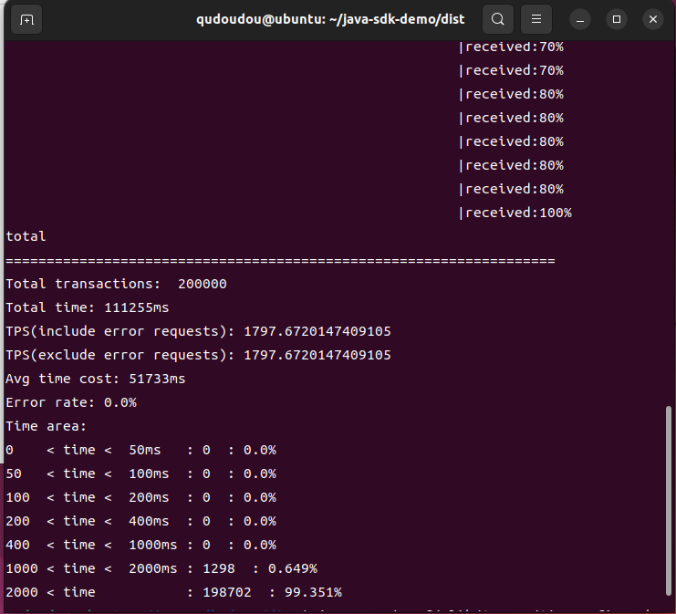

# Fisco_Test

使用Java SDK调用智能合约来对FISCO区块链中的节点进行压力测试。

## FISCO BCOS的Java SDK Demo介绍

- Java SDK Demo是FISCO BCOS团队基于Java SDK的基准测试集合，能够对FISCO BCOS节点进行压力测试。Java SDK Demo提供有合约编译功能，能够将Solidity合约文件转换成Java合约文件，此外还提供了针对转账合约、CRUD合约以及AMOP功能的压力测试示例程序

## 环境准备

- Java SDK Demo中的测试程序能够在部署有JDK 1.8 ~ JDK 14的环境中运行，执行测试程序前请先确保已安装所需版本的JDK。以在Ubuntu系统中安装OpenJDK 11为例：

~~~bash
# 安装open JDK 11
sudo apt install openjdk-11-jdk
# 验证Java版本
java --version
# 输出以下内容：
# openjdk 11.0.10 2021-01-19
# OpenJDK Runtime Environment (build 11.0.10+9-Ubuntu-0ubuntu1.20.04)
# OpenJDK 64-Bit Server VM (build 11.0.10+9-Ubuntu-0ubuntu1.20.04, mixed mode, sharing)
~~~

## 编译源码

~~~bash
# 下载源码
git clone https://github.com/FISCO-BCOS/java-sdk-demo
cd java-sdk-demo
# 切换到2.0版本
git checkout main-2.0
# 编译源码
./gradlew build 
#当网络无法访问GitHub时，请从https://gitee.com/FISCO-BCOS/java-sdk-demo处的main-2.0分支下载源码。
~~~

## 配置Demo

- 使用Java SDK Demo之前，需要进行证书拷贝以及区块链节点端口的配置，我的区块链环境是按照FISCO BCOS开发文档配置的本地四节点联盟链，以下操作以此环境为基础

~~~bash
cd dist
# 拷贝证书(假设SDK证书位于~/fisco/nodes/127.0.0.1/sdk目录，请根据实际情况更改路径)
cp -r ~/fisco/nodes/127.0.0.1/sdk/* conf

# 拷贝配置文件
# 注:
#   默认搭建的FISCO BCOS区块链系统Channel端口是20200，若修改了该端口，请同步修改config.toml中的[network.peers]配置选项
cp conf/config-example.toml conf/config.toml
~~~

- 由于我的区块链环境具有四个节点，所以应该修改java-sdk-demo/dist/conf/config.toml下的network.peers配置

## 执行压力测试程序

- Java SDK Demo提供了一系列压测程序，包括串行转账合约压测、并行转账合约压测、AMOP压测等，具体使用方法如下：

~~~bash
# 进入dist目录
cd dist

# 将需要转换为java代码的sol文件拷贝到dist/contracts/solidity路径下
# 转换sol, 其中${packageName}是生成的java代码包路径
# 生成的java代码位于 /dist/contracts/sdk/java目录下
java -cp "apps/*:lib/*:conf/" org.fisco.bcos.sdk.demo.codegen.DemoSolcToJava ${packageName}

# 压测串行转账合约:
# count: 压测的交易总量
# tps: 压测QPS
# groupId: 压测的群组ID
java -cp 'conf/:lib/*:apps/*' org.fisco.bcos.sdk.demo.perf.PerformanceOk [count] [tps] [groupId]

# 压测并行转账合约
# --------------------------
# 基于Solidity并行合约parallelok添加账户:
# groupID: 压测的群组ID
# count: 压测的交易总量
# tps: 压测QPS
# file: 保存生成账户的文件名
java -cp 'conf/:lib/*:apps/*' org.fisco.bcos.sdk.demo.perf.ParallelOkPerf [parallelok] [groupID] [add] [count] [tps] [file]
# 基于Precompiled并行合约precompiled添加账户
# (参数含义同上)
java -cp 'conf/:lib/*:apps/*' org.fisco.bcos.sdk.demo.perf.ParallelOkPerf [precompiled] [groupID] [add] [count] [tps] [file]
# --------------------------
# 基于Solidity并行合约parallelok发起转账交易压测
# groupID: 压测的群组ID
# count: 压测的交易总量
# tps: 压测的QPS
# file: 转账用户文件
java -cp 'conf/:lib/*:apps/*' org.fisco.bcos.sdk.demo.perf.ParallelOkPerf [parallelok] [groupID] [transfer] [count] [tps] [file]
# 基于Precompiled并行合约Precompiled发起转账压测
java -cp 'conf/:lib/*:apps/*' org.fisco.bcos.sdk.demo.perf.ParallelOkPerf [precompiled] [groupID] [transfer] [count] [tps] [file]

# CRUD合约压测
# 压测CRUD insert
# count: 压测的交易总量
# tps: 压测QPS
# groupId: 压测群组
java -cp 'conf/:lib/*:apps/*' org.fisco.bcos.sdk.demo.perf.PerformanceTable [insert] [count] [tps] [groupId]
# 压测CRUD update
# (参数解释同上)
java -cp 'conf/:lib/*:apps/*' org.fisco.bcos.sdk.demo.perf.PerformanceTable [update] [count] [tps] [groupId]
# 压测CRUD remove
# (参数解释同上)
java -cp 'conf/:lib/*:apps/*' org.fisco.bcos.sdk.demo.perf.PerformanceTable [remove] [count] [tps] [groupId]
# 压测CRUD query
# (参数解释同上)
java -cp 'conf/:lib/*:apps/*' org.fisco.bcos.sdk.demo.perf.PerformanceTable [query] [count] [tps] [groupId]
~~~

## 压测自定义合约

- 在现实生产中，我们需要对自己定义的智能合约进行压力测试，因此需要将自己编写的智能合约加入Java SDK Demo中，同时还要编写相应的压力测试程序，来测试合约中指定的功能。
- 压测自定义合约的开发均在Java SDK Demo中进行，我们需要开发三个文件，分别是：
  1. 待压测的智能合约：HelloWorld.sol
  2. 带压测的智能合约所编译出的Java类：HelloWorld.java(可以使用FISCO BCOS控制台的脚本进行智能合约到Java代码的自动转换，具体操作方式见FISCO BCOS系统开发文档中Java SDK的引入)
  3. 压力测试程序：PerformanceHelloWorld.java

### 项目的存放路径

- 以上三个文件的存放路径如下

  ~~~bash
  java-sdk-demo/src/main/java/org/fisco/bcos/sdk/demo
                                                ├── contract
                                                │   ├── HelloWorld.java
                                                │   └── sol
                                                │       └── HelloWorld.sol
                                                └── perf
                                                    └── PerformanceHelloWorld.java
  ~~~

### 以HelloWorld合约为例，开发压测程序

- 压力测试程序的写法可以根据Java SDK Demo中提供的示例程序进行修改，这里展示基于HelloWorld合约写出的压力测试程序，测试的是HelloWorld合约中的set方法

  1. HelloWorld.sol

     ~~~solidity
     pragma solidity>=0.4.24 <0.6.11;
     
     contract HelloWorld {
         string name;
     
         constructor() public {
             name = "Hello, World!";
         }
     
         function get() public view returns (string memory) {
             return name;
         }
     
         function set(string memory n) public {
             name = n;
         }
     }
     ~~~

  2. HelloWorld.java(使用脚本根据HelloWorld.sol自动生成，这里不做展示)

  3. PerformanceHelloWorld.java

     ~~~java
     /**
      * Copyright 2014-2020 [fisco-dev]
      *
      * 
Licensed under the Apache License, Version 2.0 (the "License"); you may not use this file
      * except in compliance with the License. You may obtain a copy of the License at
      *
      * 
http://www.apache.org/licenses/LICENSE-2.0
      *
      * 
Unless required by applicable law or agreed to in writing, software distributed under the
      * License is distributed on an "AS IS" BASIS, WITHOUT WARRANTIES OR CONDITIONS OF ANY KIND, either
      * express or implied. See the License for the specific language governing permissions and
      * limitations under the License.
      */
     package org.fisco.bcos.sdk.demo.perf;
     
     import com.google.common.util.concurrent.RateLimiter;
     import java.math.BigInteger;
     import java.net.URL;
     import java.util.concurrent.atomic.AtomicInteger;
     import org.fisco.bcos.sdk.BcosSDK;
     import org.fisco.bcos.sdk.BcosSDKException;
     import org.fisco.bcos.sdk.client.Client;
     import org.fisco.bcos.sdk.demo.contract.HelloWorld;
     import org.fisco.bcos.sdk.demo.perf.callback.PerformanceCallback;
     import org.fisco.bcos.sdk.demo.perf.collector.PerformanceCollector;
     import org.fisco.bcos.sdk.model.ConstantConfig;
     import org.fisco.bcos.sdk.model.TransactionReceipt;
     import org.fisco.bcos.sdk.transaction.model.exception.ContractException;
     import org.fisco.bcos.sdk.utils.ThreadPoolService;
     import org.slf4j.Logger;
     import org.slf4j.LoggerFactory;
     
     public class PerformanceHelloWorld {
         private static Logger logger = LoggerFactory.getLogger(PerformanceHelloWorld.class);
         private static AtomicInteger sendedTransactions = new AtomicInteger(0);
     
         private static void Usage() {
             System.out.println(" Usage:");
             System.out.println(
                     " \t java -cp 'conf/:lib/*:apps/*' org.fisco.bcos.sdk.demo.perf.PerformanceHelloWorld [count] [tps] [groupId].");
         }
     
         public static void main(String[] args) {
             try {
                 String configFileName = ConstantConfig.CONFIG_FILE_NAME;
                 URL configUrl = PerformanceOk.class.getClassLoader().getResource(configFileName);
     
                 if (configUrl == null) {
                     System.out.println("The configFile " + configFileName + " doesn't exist!");
                     return;
                 }
                 if (args.length < 3) {
                     Usage();
                     return;
                 }
                 Integer count = Integer.valueOf(args[0]);
                 Integer qps = Integer.valueOf(args[1]);
                 Integer groupId = Integer.valueOf(args[2]);
                 System.out.println(
                         "====== PerformanceOk trans, count: "
                                 + count
                                 + ", qps:"
                                 + qps
                                 + ", groupId: "
                                 + groupId);
     
                 String configFile = configUrl.getPath();
                 BcosSDK sdk = BcosSDK.build(configFile);
     
                 // build the client
                 Client client = sdk.getClient(groupId);
     
                 // deploy the HelloWorld
                 System.out.println("====== Deploy Ok ====== ");
                 HelloWorld helloWorld = HelloWorld.deploy(client, client.getCryptoSuite().getCryptoKeyPair());
                 System.out.println(
                         "====== Deploy HelloWorld succ, address: " + helloWorld.getContractAddress() + " ====== ");
     
                 PerformanceCollector collector = new PerformanceCollector();
                 collector.setTotal(count);
                 RateLimiter limiter = RateLimiter.create(qps);
                 Integer area = count / 10;
                 final Integer total = count;
     
                 System.out.println("====== PerformanceOk trans start ======");
     
                 ThreadPoolService threadPoolService =
                         new ThreadPoolService(
                                 "PerformanceHelloWorld",
                                 sdk.getConfig().getThreadPoolConfig().getMaxBlockingQueueSize());
     
                 for (Integer i = 0; i < count; ++i) {
                     limiter.acquire();
                     threadPoolService
                             .getThreadPool()
                             .execute(
                                     new Runnable() {
                                         @Override
                                         public void run() {
                                             PerformanceCallback callback = new PerformanceCallback();
                                             callback.setTimeout(0);
                                             callback.setCollector(collector);
                                             try {
                                                 helloWorld.set("Hello, fisco", callback);
                                             } catch (Exception e) {
                                                 TransactionReceipt receipt = new TransactionReceipt();
                                                 receipt.setStatus("-1");
                                                 callback.onResponse(receipt);
                                                 logger.info(e.getMessage());
                                             }
                                             int current = sendedTransactions.incrementAndGet();
                                             if (current >= area && ((current % area) == 0)) {
                                                 System.out.println(
                                                         "Already sended: "
                                                                 + current
                                                                 + "/"
                                                                 + total
                                                                 + " transactions");
                                             }
                                         }
                                     });
                 }
                 // wait to collect all the receipts
                 while (!collector.getReceived().equals(count)) {
                     Thread.sleep(1000);
                 }
                 threadPoolService.stop();
                 System.exit(0);
             } catch (BcosSDKException | ContractException | InterruptedException e) {
                 System.out.println(
                         "====== PerformanceOk test failed, error message: " + e.getMessage());
                 System.exit(0);
             }
         }
     }
     ~~~

### HelloWorld合约的压力测试

- 将上述三个文件放入对应的目录后，执行以下操作对HelloWorld合约进行压力测试

  ~~~bash
  cd /java-sdk-demo/dist
  #200000代表总测试量为200000   10000代表每秒向区块链系统发送10000次请求   1代表区块链系统的groupId
  java -cp 'conf/:lib/*:apps/*' org.fisco.bcos.sdk.demo.perf.PerformanceHelloWorld 200000 10000 1
  ~~~

- 压力测试结果如下，可以看到本机的四节点区块链系统对HelloWorld合约里set方法的TPS为1797.67

